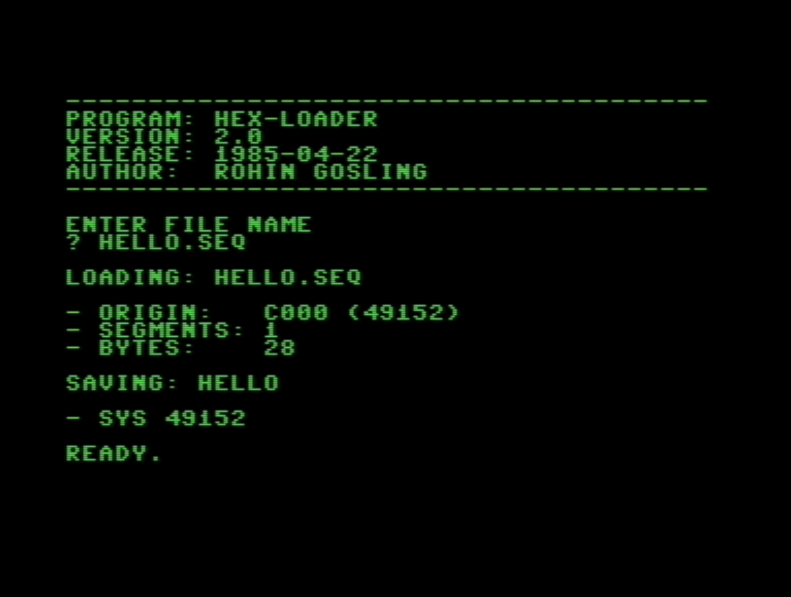
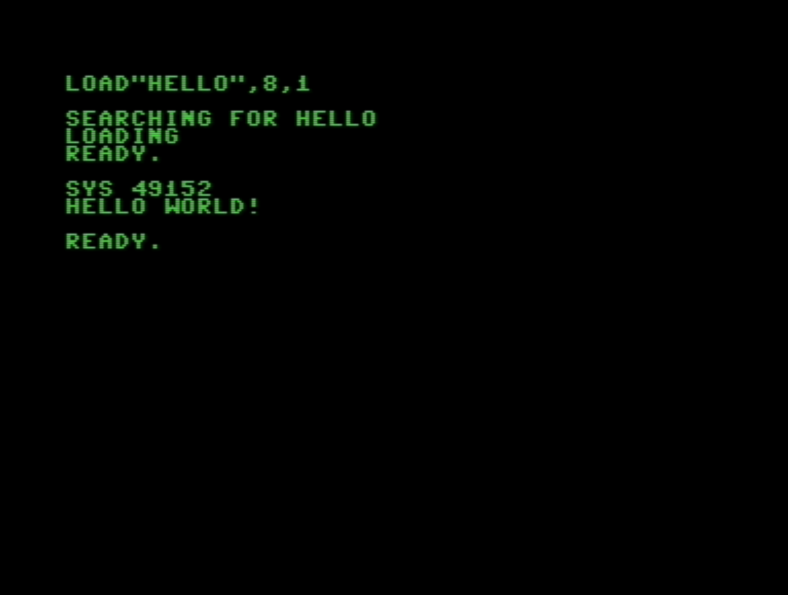

# HEX-Loader

|||||
|:---:|:---:|:---:|:---:|
||||

A Commodore 64 BASIC program that loads hex-encoded 6502/6510 machine language into memory.

- Back in the 1980s many of us never had cartridge or software based monitors (debuggers) or assemblers.
- In the absence of these tools we would write simple machine language loaders in BASIC.
- The workflow was roughly;
  1. Hand-assemble an assembly language programs on pencil and paper.
  2. Type the op-codes into a BASIC loader, usually through a set of BASIC `DATA` statements.
  3. Then run the BASIC loader, which would write all of the machine language op codes into RAM.
  4. Execute a `SYS <address>` command to run the machine language program.

At this time, I wrote a series of development tools including a BASIC loader that could parse strings of HEX opcodes and address commands, making the hand-assembly to type-in process a bit more comfortable in the absence of a proper monitor.
- I very creativly called the HEX op-code machine language loader, `HEX-Loader`.
- I wrote two versions of `HEX-Loader`, one that stored the HEX encoded machine language as text strings in `DATA` statements, and another more memory friendly version that read the machine language op-codes from a sequence (text) file.
- The sequence-file version of `HEX-Loader` was the one I used to use the most, but it had an extra step to use it. The workflow was;

  1. Hand-assemble assembly program to HEX opcodes.
  2. Type the HEX op-codes into a machine language sequence file generator.
     - The machine language sequence file generator was similar to a regular BASIC machine language loader program, except it just saved the strings of HEX op-codes to a sequence file, instead of loading them into RAM.
     - "Sequence file" was just the name used in the Commodore ecosystem in those days for plain text files.
  3. Run `HEX-Loader` to read the sequence file, and load all the machine language from the sequence file into RAM.
  4. Execute the program using `SYS <address>`.
     - For smaller machine language programs, of the scale I typically used `HEX-Loader` for, you could keep the BASIC interpreter in RAM, and take advantage of it to embed BASIC op-codes into the machine language program so that you could just type `RUN` to execute the program like a regular BASIC program, instead of having to type `SYS <address>`. See examples below. 

## Overview

This overview covers the sequence-file version of `HEX-Loader`, since that was the one I used to use the most. I wrote versions for both the VIC-20 and C64. This overview covers the C64 version.

`HEX-Loader` reads hex-encoded machine language data, tokenizes it, compiles the tokens into bytes, and POKEs them directly into C64 RAM. It supports multiple memory segments and prints a `SYS` entry point for immediate execution.

## Sequence File - Hex Data Format

Machine language programs are stored in plain text sequence files, with each line being a string of space-separated hex bytes, with address commands to set the load origin address. 

Address commands can be include in any line in the sequence file to set a new base address for bytes that follow, allowing for easy positioning of code in RAM.

|HEX-Encoded 6502/10 Machine Language|Description
|:--|:--|
|`* C000`|Set origin address command `* XXXX`.<br>Sets origin address for subsequent writes to RAM.|
|`A2 00 BD 0E C0 F0 06 20`|HEX 6502 op-code bytes. 8 per line by default.|
|`D2 FF E8 D0 F5 60 48 45`||
|`4C 4C 4F 20 57 4F 52 4C`||
|`44 21 0D 00`|Can have less than 8 bytes per line at the end of the program.|
|`* C020`|Set new origin address.|
|`EA EA EA EA EA EA EA EA`|Arbitrary no-ops for demonstration purposes.|
|`60`|In some scenarios it can be useful to put an `RTS` (Return to BASIC) at the end for the sake of safety.<br>Helps to minimize system hangs when the instruction pointer runs off into the woods.|

## HEX-Loader - Usage Workflow

### 1. Hand assemble Program

Hand assemble an assembly language program into 6502 machine language. For example the "Hello World!" program below. This would typically require using an 6502/6510 instruction set table or reference. I used to use the instruction set reference in the "Commodore 64 Programmers Reference Guide". 

**Annotated Assembly**

```
                  ; Program entry point.

                   * = $C000

C000  A2 00       LDX #$00       ; X = string index
C002  BD 0E C0    LDA $C00E,X    ; load char from message
C005  F0 06       BEQ $C00D      ; if null, branch to RTS
C007  20 D2 FF    JSR $FFD2      ; KERNAL CHROUT
C00A  E8          INX            ; next character
C00B  D0 F5       BNE $C002      ; loop back
C00D  60          RTS            ; return to BASIC

; Message data at $C00E:

C00E  48 45 4C 4C 4F 20 57 4F    ; "HELLO WO...
C016  52 4C 44 21 0D 00          ; ...RLD!" + CR + null
```

**Machine Code**

```
C000: A2 00 BD 0E C0 F0 06 20
C008: D2 FF E8 D0 F5 60 48 45
C010: 4C 4C 4F 20 57 4F 52 4C
C018: 44 21 0D 00 .. .. .. ..
```

### 2. Prepare HEX-Loader Sequence File

Write a BASIC program to save the machine language op-codes to a sequence file in the format expected by HEX-Loader. The example below saves the op-codes to a sequence file named `HELLO.SEQ`.

**Note:** The `.SEQ` file extension is not required, but I used to like using *DOS-like* file extensions in anticipation of one day having an 8086 with DOS. If only I could go back in time and show my 11 year old self the Ryzen 9/RTX 5080 system I have today.

**Sequence File Generator**

```BASIC
0 REM ----------------------------------
1 REM BASIC PROGRAM TO SAVE MACHINE
2 REM LANGUAGE CODE TO DISK.
3 REM USE HEX-LOADER TO LOAD THE 
4 REM OP-CODES AND EXECUTE.
9 REM ----------------------------------
10 OPEN 1,8,1,"HELLO.SEQ,S,W"
20 : READ S$
30 : IF S$="END" THEN 60
40 : PRINT#1,S$
50 : GOTO 20
60 CLOSE 1
70 END
10000 DATA "* C000"
10010 DATA "A2 00 BD 0E C0 F0 06 20"
10020 DATA "D2 FF E8 D0 F5 60 48 45"
10030 DATA "4C 4C 4F 20 57 4F 52 4C"
10040 DATA "44 21 0D 00"
19999 DATA "END"
```

**HELLO.SEQ**

```
* C000
A2 00 BD 0E C0 F0 06 20
D2 FF E8 D0 F5 60 48 45
4C 4C 4F 20 57 4F 52 4C
44 21 0D 00
```

### 3. Use HEX-Loader to Load and Execute

Load `HEX-LOADER 2.0` from disk, run, and load the machine language sequence file. 
- If the machine langauge sequence file is named `X.SEQ`, then the machine langauge `PRG` file will be named `X`.
- In the example below, the machine language sequence file `HELLO.SEQ`, is compiled to a machine language `PRG` file named `HELLO`.


Load the machine language program from disk, and run using the `SYS` command.


## File Listing

| File                                           | Description                                              |
|------------------------------------------------|----------------------------------------------------------|
| `hex-loader 2.0.bas`                           | Loader program, latest (reads from sequential file)      |
| `hex-loader 1.0.bas`                           | Previous loader (reads from inline DATA statements)      |
| `tokenizer 2.5.bas`                            | Interactive test harness for tokenizer/compiler           |
| `clr-b.bas`                                    | Clear screen to black BASIC utility                      |
| `hello.asm`                                    | Example 6502 assembly source                             |
| `hello.asm.txt`                                | Same example with annotated address listing               |
| `hello.ml.bas`                                 | BASIC program that writes hello-world hex data to disk   |
| `hello.seq`                                    | Sequential file containing hello-world hex data          |
| `cls.asm.txt`                                  | CLS annotated 6502 assembly listing (clear screen)       |
| `cls.ml.bas`                                   | BASIC program that writes CLS hex data to disk           |
| `prompt.md`                                    | Design notes for the DATA-PROBE monitor                  |
| `Project - HEX-Loader.d64`                     | Commodore 1541 disk image with compiled programs         |

## License

This is a personal retrocomputing project shared for historical and educational purposes.


